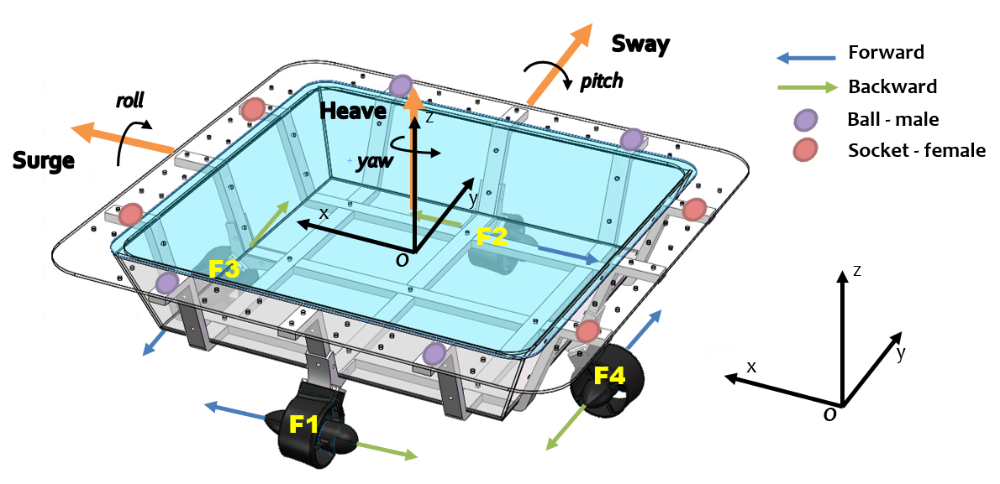
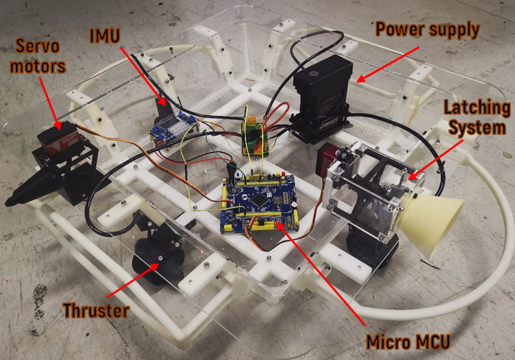
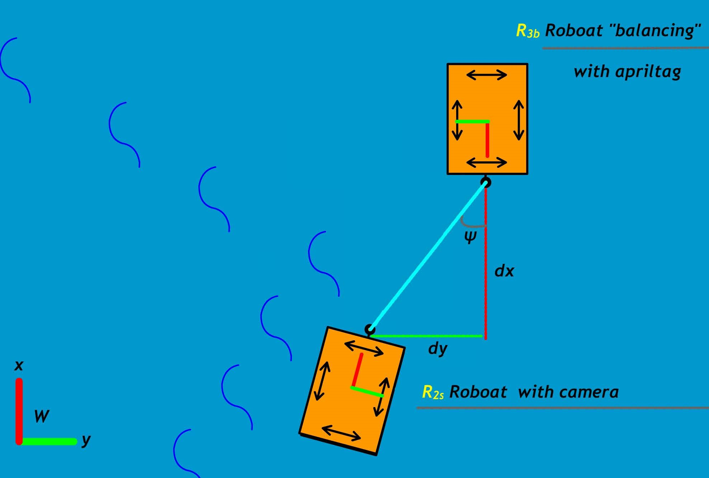

# Auto Docking Vessels

This project presents a Webots simulation environment and a vision-based  autonomous docking algorithm for robotic vessels with a novel latching system that enables robotic boats to create dynamic united floating infrastructure while overcoming water disturbances. 

This project is fonded by China National Innovation and Entrepreneurship Training Program.

## Features
- Docking scene simulation in Webots
- Vision-based  autonomous docking algorithm
- ArUco pose estimation
- Omni-directional locomotion controller
- GPS and IMU filtering with the moving window filter

https://user-images.githubusercontent.com/44640904/200079468-297da9ee-3118-4b4e-a9ad-d3602cf2e2f2.mp4

## Control Algorithm

**Control I**: Minimize lateral distance $d_y$

**Control II**: Minimize longitudinal distance $d_x$

**Control III**: Minimize the angle $\psi$ between the entities

## Dependencies
- Webots R2021b or above
- `opencv_contrib_python`
- `inputs`

## Reference
[1] Mateos L A, Wang W, Gheneti B, et al. Autonomous latching system for robotic boats[C]//2019 International Conference on Robotics and Automation (ICRA). IEEE, 2019: 7933-7939.

[2] Wang W, Mateos L A, Park S, et al. Design, modeling, and nonlinear model predictive tracking control of a novel autonomous surface vehicle[C]//2018 IEEE International Conference on Robotics and Automation (ICRA). IEEE, 2018: 6189-6196.

[3] Wang W, Mateos L, Wang Z, et al. Cooperative control of an autonomous floating modular structure without communication[C]//2019 International Symposium on Multi-Robot and Multi-Agent Systems (MRS). IEEE, 2019: 44-46.

[4] Kayacan E, Park S, Ratti C, et al. Online system identification algorithm without persistent excitation for robotic systems: Application to reconfigurable autonomous vessels[C]//2019 IEEE/RSJ International Conference on Intelligent Robots and Systems (IROS). IEEE, 2019: 1840-1847.

[5] Wang W, Gheneti B, Mateos L A, et al. Roboat: An autonomous surface vehicle for urban waterways[C]//2019 IEEE/RSJ International Conference on Intelligent Robots and Systems (IROS). IEEE, 2019: 6340-6347.

[6] Gheneti B, Park S, Kelly R, et al. Trajectory planning for the shapeshifting of autonomous surface vessels[C]//2019 International Symposium on Multi-Robot and Multi-Agent Systems (MRS). IEEE, 2019: 76-82.
